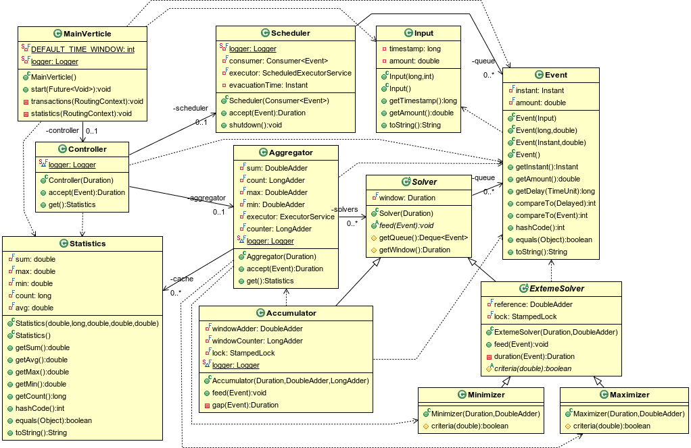

[](https://www.codacy.com/app/conrado-m/stock?utm_source=github.com&amp;utm_medium=referral&amp;utm_content=conrado-m/stock&amp;utm_campaign=Badge_Grade)
[](https://travis-ci.org/crgz/transactions)
[](https://coveralls.io/github/crgz/transactions?branch=master)
[](https://www.gnu.org/licenses/old-licenses/gpl-2.0.en.html)
[](http://makeapullrequest.com)


# Handling stocks for availability


## 💡 Synopsis

This repository contains the preliminary implementation of a simple [end to end](https://en.wikipedia.org/wiki/End-to-end_principle) [event-driven](https://en.wikipedia.org/wiki/Event-driven_programming) [reactive](https://en.wikipedia.org/wiki/Reactive_programming) JSON [REST](https://en.wikipedia.org/wiki/Representational_state_transfer) APIs for reporting [streamed](https://en.wikipedia.org/wiki/Event_stream_processing) statistics over a sliding window of pre-established time. The current default time of operation is 60 seconds. The API minimize processing time using [non-blocking asynchronous I/O](https://en.wikipedia.org/wiki/Asynchronous_I/O).

The primary input end-point of this API is in charge of loading data into the system in the form of events. Is called every time a transaction is made. The other one returns the statistic of the events collected during the pre-defined window of time. 

## Prerequisites

* Apache Maven
* JDK 8+

## 💾 Building the project

To build the project, just use:
```bash
mvn clean package
```
It generates a _fat-jar_ in the `target` directory.
## ⚙️ Execution
The command compiles the project and runs the tests, then  it launches the application, so you can check by yourself.

```bash
mvn test exec:java
```
Or...
```bash
java -jar target/transactions-1.0-fat.jar -conf target/classes/production-config.json
```
## ▶️ Usage
[](https://app.getpostman.com/run-collection/73a0c326f4f0d15061d1)
[](doc/Transactions API.postman_collection.json)

### POST /transactions
This end-point updates the current stock of a particular product. 

The JSON body you can put:

```json
{
      "amount": 12.3,
  "timestamp": 1478192204000
}
```

| Filed     | Description                                          |
|-----------|------------------------------------------------------|
| amount    | transaction amount                                   |
| timestamp | transaction time in epoch in millis in UTC time zone |

**Returns**

Empty body with either 201 or 204

| Code   | Condition                               |
|--------|-----------------------------------------|
|   201  | In case of success                      |
|   204  | If transaction is older than 60 seconds |

### GET /statistics

This is the main end-point. It returns the statistic based on the transactions which happened in the last 60
seconds.

**Returns**

```json
{
    "sum": 1000,
    "avg": 100,
    "max": 200,
    "min": 50,
  "count": 10
}
```

| Field     | Description                           |
|-----------|---------------------------------------|
|**sum:**   | Total sum of transaction value        |
|**avg:**   | Average  amount of transaction value  |
|**max:**   | Single highest transaction value      | 
|**min:**   | Single lowest transaction value       |
|**count:** | Total number of transactions happened |

**Note:**
* All values are numbers.
* All values correspond to transactions happening in the last 60 seconds.

## 🚅 Implementation
This is the UML of the implemented logic:



## 🌡 Unit tests
Run this command to tests your application components:

```bash
mvn clean test
```
## 🏁 End to end tests
Run this command to tests your application integration end to end tests:

```bash
mvn verify
```
## 🎁 Contributing

1. Fork it!
2. Create your feature branch: `git checkout -b my-new-feature`
3. Commit your changes: `git commit -am 'Add some feature'`
4. Push to the branch: `git push origin my-new-feature`
5. Submit a pull request :D

## 🎓 License
This experiment is released under the [GPL v2](https://www.gnu.org/licenses/old-licenses/gpl-2.0.en.html).
